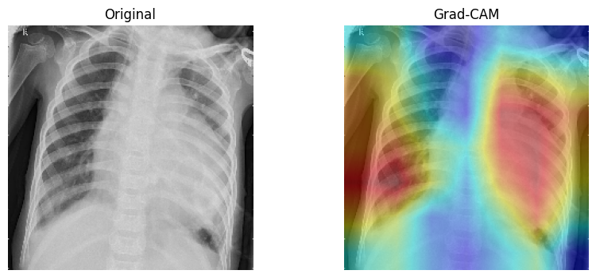
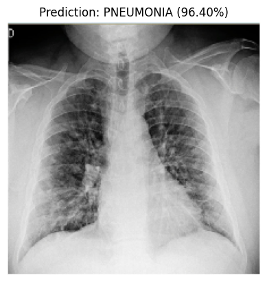

## 🩺 Pneumonia Detection Using Deep Learning
Chest X-ray Classification with MobileNetV2, Transfer Learning & Grad-CAM
### 📌 Project Summary
This project uses Deep Learning (CNN + Transfer Learning) to classify chest X-ray images into Normal or Pneumonia.
It follows a complete machine learning workflow — data preprocessing, model building, training, evaluation, and model interpretability.

---
### 🚀 Features
```bash
✔ End-to-end Deep Learning pipeline
✔ Transfer Learning using MobileNetV2
✔ Fine-tuning for improved accuracy
✔ Confusion Matrix, Precision, Recall, F1-score
✔ Grad-CAM heatmaps for interpretability
✔ Lightweight and reproducible

```
---

### 📂 Repository Structure

```bash
pneumonia-detection-deeplearning/
│
├── README.md
│
├── notebook/
│   └── Pneumonia_Detection.ipynb
│
├── models/
│   ├── best_model.h5
│   └── pneumonia_detector.keras   
│
├── assets/
│   ├── sample_chest_xrays/
│   ├── gradcam_examples/
│   └── results/
│
├── scripts/
│   └── predict_single_image.py
│
├── requirements.txt
│
└── .gitignore
```
---

### 🧠 Model Architecture

The project uses MobileNetV2 as a feature extractor because it is:

- Efficient

- Lightweight

- Accurate

- Suitable for medical imaging transfer learning

- Load MobileNetV2 with pretrained ImageNet weights

- Freeze base layers

- Train custom dense layers

- Unfreeze top layers for fine-tuning

---

### 📊 Evaluation Results

Classification Report
| Metric    | Normal | Pneumonia |
| --------- | ------ | --------- |
| Precision | 0.92   | 0.84      |
| Recall    | 0.70   | 0.97      |
| F1-Score  | 0.79   | 0.90      |
---
### ⭐ Overall Accuracy: 86%
🔍 Grad-CAM Visualizations

---



Grad-CAM heatmaps highlight lung regions responsible for model predictions.

This adds explainability, which is crucial for medical AI applications.


--- 

### Output example:


```bash
Prediction: PNEUMONIA (96.40% confidence)
```
---
### 📚 Dataset

The model uses Kaggle Chest X-Ray Pneumonia Dataset:

🔗 [https://www.kaggle.com/datasets/paultimothymooney/chest-xray-pneumonia](https://www.kaggle.com/datasets/paultimothymooney/chest-xray-pneumonia)

Dataset size: 5,800+ images

Structure:
```bash
train/
val/
test/
```
---
### 🛠 Tech Stack

- Python

- TensorFlow 

- NumPy

- Matplotlib

- Seaborn

- Google Colab


